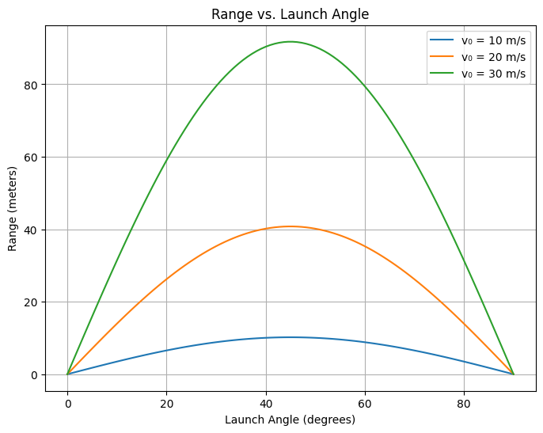

# Problem 1

## Investigating the Range as a Function of the Angle of Projection

## 1. Problem Statement

The objective of this project is to explore how the **horizontal range** of a projectile varies with the **launch angle**. Though simple at first glance, this classical physics problem reveals deep insights into motion under gravity.

---

## Motivation

Projectile motion is more than just a textbook topic—it forms the foundation for countless real-world phenomena, from sports to spaceflight.

Despite its apparent simplicity, this motion is governed by:

- Linear and quadratic kinematic relationships
- Free parameters like:
  - Initial velocity $v_0$
  - Gravitational acceleration $g$
  - Launch angle $\theta$
  - (Optional) Launch height

These factors interact to produce a variety of possible outcomes and open doors to creative and scientific exploration.

---

## Task Overview

### 1️- Theoretical Foundation

- Begin with Newton’s equations to derive the projectile motion formula.
- Focus on the **range equation**:

  $$R = \frac{v_0^2 \sin(2\theta)}{g}$$

- Discuss how different values of $v_0$ and $g$ change the outcome.

- Explain how this results in a _family of parabolic paths_ depending on launch parameters.

---

### 2. Analysis of the Range

- Examine how the **range** $R$ varies with the **angle of projection** $theta$.
- Observe and interpret the symmetry of the plot:

  - $\theta = 45^\circ$ yields **maximum range**
  - Complementary angles (e.g., 30° and 60°) yield the **same range**

- Understand how:
  - Increasing $v_0$ increases range
  - Increasing $g$ reduces range

---

### 3. Real-World Applications

Projectile motion applies to countless real-life situations:

- **Sports**: Kicking a football, shooting a basketball
- **Engineering**: Launching projectiles and drones
- **Space Science**: Modeling launches on the Moon or Mars
- **Military**: Calculating ballistic paths

These models provide not just theoretical understanding but also practical insights.

---

### 4️. Python Simulation

```python
import numpy as np
import matplotlib.pyplot as plt

def compute_range(v0, theta_deg, g=9.81):
    theta_rad = np.radians(theta_deg)
    return (v0**2 * np.sin(2 * theta_rad)) / g

# Parameters
angles = np.linspace(0, 90, 100)  # Angles from 0° to 90°
velocities = [10, 20, 30]         # Different initial velocities in m/s

# Plotting
plt.figure(figsize=(8, 6))
for v in velocities:
    ranges = [compute_range(v, angle) for angle in angles]
    plt.plot(angles, ranges, label=f'v₀ = {v} m/s')

plt.title('Range vs. Launch Angle')
plt.xlabel('Launch Angle (degrees)')
plt.ylabel('Range (meters)')
plt.grid(True)
plt.legend()
plt.show()

```


