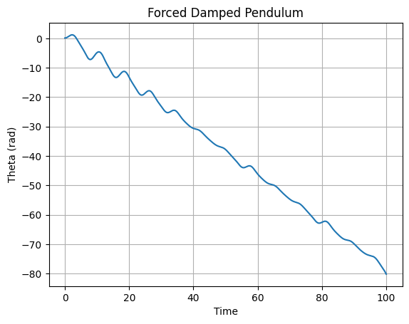

# Problem 2:

# Investigating the Dynamics of a Forced Damped Pendulum

## 🔍 Motivation

The **forced damped pendulum** is a captivating example of a nonlinear dynamical system that showcases a wide spectrum of behaviors, from predictable oscillations to unpredictable chaos. The richness of this system arises from the **interplay between damping**, **restoring forces**, and **external periodic forcing**.

By modifying parameters such as **damping coefficient ($\\gamma$)**, **driving amplitude ($A$)**, and **driving frequency ($\\omega$)**, one can observe:

- Regular harmonic motion
- Resonance amplification
- Quasiperiodic and chaotic dynamics

These phenomena are foundational to understanding complex systems in nature and engineering. Real-world analogs include:

- Climate systems influenced by periodic solar cycles
- Vibration control in buildings and bridges
- Resonance phenomena in circuits and mechanical components

---

## 1. Theoretical Foundation

The governing equation for a forced damped pendulum is:

$$
\\frac{d^2\\theta}{dt^2} + \\gamma \\frac{d\\theta}{dt} + \\omega_0^2 \\sin\\theta = A \\cos(\\omega t)
$$

Where:

- $\\theta$: angular displacement
- $\\gamma$: damping coefficient
- $\\omega_0$: natural frequency
- $A$: amplitude of the driving force
- $\\omega$: frequency of the driving force

### 🔸 Small-Angle Approximation

For small oscillations ($\\theta \\ll 1$), we linearize the system:

$$
\\frac{d^2\\theta}{dt^2} + \\gamma \\frac{d\\theta}{dt} + \\omega_0^2\\theta = A \\cos(\\omega t)
$$

This becomes a classic driven harmonic oscillator, where resonance can occur when $\\omega \\approx \\omega_0$.

---

## 2. Analysis of Dynamics

Key dynamic insights include:

- **Effect of $\\gamma$ (damping):** Higher values reduce amplitude and suppress chaotic behavior.
- **Effect of $A$ (amplitude):** Higher amplitudes can cause bifurcations and chaotic transitions.
- **Effect of $\\omega$ (driving frequency):** Controls resonance and frequency locking.

### Chaos and Bifurcation

Nonlinearity ($\sin\theta$) introduces complex behavior:

- **Phase diagrams** show how trajectories evolve.
- **Poincaré sections** reveal periodic, quasiperiodic, or chaotic attractors.
- **Lyapunov exponents** (optional extension) can measure sensitivity to initial conditions.

---

## 3. Practical Applications

- **Energy Harvesting**: Tuning systems to capture maximum vibrational energy.
- **Mechanical Engineering**: Avoiding catastrophic resonance in buildings and bridges.
- **Electronics**: Understanding RLC circuits and analog oscillators.

---

## 4. Implementation in Python

```python
import numpy as np
import matplotlib.pyplot as plt
from scipy.integrate import solve_ivp

def pendulum(t, y, gamma, omega0, A, omega):
    theta, v = y
    dydt = [v, -gamma*v - omega0**2*np.sin(theta) + A*np.cos(omega*t)]
    return dydt

def simulate(gamma, omega0, A, omega, y0, t_span, t_eval):
    sol = solve_ivp(pendulum, t_span, y0, args=(gamma, omega0, A, omega), t_eval=t_eval)
    return sol

# Parameters
gamma = 0.2
omega0 = 1.0
A = 1.2
omega = 0.8
y0 = [0.1, 0.0]
t_span = (0, 100)
t_eval = np.linspace(*t_span, 2000)

sol = simulate(gamma, omega0, A, omega, y0, t_span, t_eval)

plt.plot(sol.t, sol.y[0])
plt.xlabel('Time')
plt.ylabel('Theta (rad)')
plt.title('Forced Damped Pendulum')
plt.grid()
plt.show()

```


