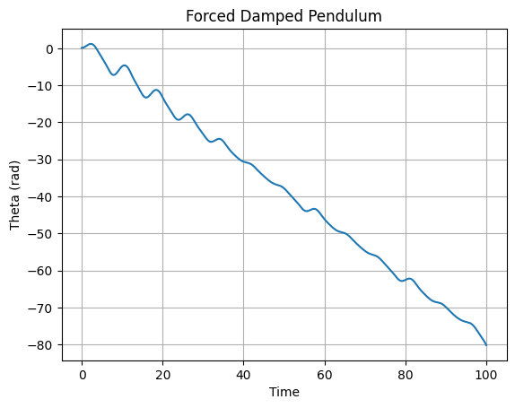

# Problem 1

## Orbital Period and Orbital Radius

### Introduction

Kepler's Third Law states that the square of the orbital period (T) is proportional to the cube of the semi-major axis (r) of the orbit:

$$ T^2 \propto r^3 $$

This fundamental principle is used to describe the motion of celestial bodies in a gravitational field. We derive this relationship from Newtonian mechanics and apply it to real-world scenarios.

### Derivation

For a small mass m orbiting a much larger mass M in a circular orbit, the gravitational force provides the necessary centripetal force:

$$ F_g = F_c $$

Using Newton’s Law of Universal Gravitation:

$$\frac{GMm}{r^2} = \frac{m v^2}{r}$$

Since orbital velocity is given by:

$$ v = \frac{2\pi r}{T} $$

Substituting this into the equation:

$$\frac{GMm}{r^2} = \frac{m}{r} \left(\frac{4\pi^2 r^2}{T^2}\right)$$

Simplifying:

$$ T^2 = \frac{4\pi^2 r^3}{GM} $$

which confirms the relationship $ T^2 \propto r^3 $.

### Computational Model

We implement a numerical simulation of a circular orbit using Python.

```python
import numpy as np
import matplotlib.pyplot as plt
from scipy.constants import G

def orbital_period(radius, mass):
    return 2 * np.pi * np.sqrt(radius**3 / (G * mass))

# Define Earth-Moon system parameters
mass_earth = 5.972e24  # kg
radius_moon = 3.844e8  # m
period_moon = orbital_period(radius_moon, mass_earth)

print(f"Orbital period of the Moon: {period_moon / (24*3600):.2f} days")

# Plot the relationship
radii = np.linspace(1e7, 1e9, 100)
periods = [orbital_period(r, mass_earth) for r in radii]

plt.figure(figsize=(8,6))
plt.plot(radii, np.array(periods)**2, label='$T^2$ vs $r^3$')
plt.xlabel("Orbital Radius (m)")
plt.ylabel("Orbital Period Squared ($T^2$)")
plt.title("Kepler's Third Law Validation")
plt.legend()
plt.show()
```



### Real-World Implications

- Used to estimate planetary masses when combined with observational data.
- Helps determine distances of exoplanets using transit and radial velocity methods.
- Applied in satellite positioning and space mission planning.

### Extension to Elliptical Orbits

For elliptical orbits, Kepler’s Third Law still holds when using the semi-major axis instead of the circular radius. The law is fundamental in celestial mechanics and remains valid for binary star systems, planetary motion, and artificial satellites.

### Conclusion

Kepler’s Third Law provides a simple yet powerful tool for understanding celestial mechanics, linking observational astronomy with fundamental physics. Our computational model verifies this relationship numerically and visually.
