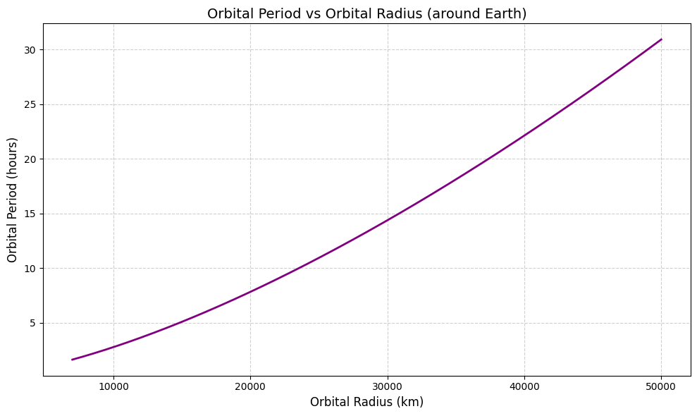

# Orbital Period and Orbital Radius – Solution and Concept

## Objective

To explore the relationship between the **orbital radius** and the **orbital period** of a satellite orbiting Earth using **Newtonian Gravity** and **Kepler’s Third Law**.

---

## Theoretical Background

### 1. **Gravitational Force Provides the Centripetal Force**

A satellite remains in orbit because gravity supplies the exact force needed to keep it moving in a circular path:

\[
\frac{G M m}{r^2} = \frac{m v^2}{r}
\]

- \( G \): Gravitational constant
- \( M \): Mass of Earth
- \( m \): Mass of satellite
- \( r \): Distance from Earth’s center (orbital radius)
- \( v \): Orbital speed

---

### 2. **Orbital Velocity**

Solving for velocity:

\[
v = \sqrt{\frac{G M}{r}}
\]

This is the speed needed for a stable circular orbit.

---

### 3. **Orbital Period**

The time for one full revolution is:

\[
T = \frac{2\pi r}{v} = 2\pi \sqrt{\frac{r^3}{G M}}
\]

This shows that the orbital period depends on the **cube of the radius**.

---

## Kepler’s Third Law of Planetary Motion

> “The square of the orbital period is proportional to the cube of the orbital radius.”

\[T^2 \propto r^3\]

### Why it matters:

- This law was first observed by **Johannes Kepler** and later explained by **Newton’s theory of gravity**.
- It is a **cornerstone of celestial mechanics**.
- It connects gravity to motion and applies to all objects in orbit — satellites, moons, and even planets around the Sun.

#### Applications:

- Predicting the position of satellites and planets
- Designing GPS, communication, and weather satellite systems
- Understanding dynamics in planetary systems and galaxies

> 💡 Kepler’s law provides a bridge between **observational astronomy** and **gravitational physics** — turning ancient star patterns into a predictive science.

---

### Implementation and Visualization in Python:

```python

import numpy as np
import matplotlib.pyplot as plt

# Constants
G = 6.67430e-11  # gravitational constant (m^3 kg^-1 s^-2)
M_earth = 5.972e24  # mass of Earth (kg)

# Define a function to calculate orbital period (seconds) given radius (meters)
def orbital_period(r, G=G, M=M_earth):
    return 2 * np.pi * np.sqrt(r**3 / (G * M))

# Generate an array of orbital radii (7000 km to 50000 km)
radii_km = np.linspace(7000, 50000, 500)
radii_m = radii_km * 1e3  # Convert to meters

# Calculate orbital periods and convert from seconds to hours
periods_sec = orbital_period(radii_m)
periods_hr = periods_sec / 3600

# Plot the relationship
plt.figure(figsize=(10, 6))
plt.plot(radii_km, periods_hr, color='purple', linewidth=2)
plt.title('Orbital Period vs Orbital Radius (around Earth)', fontsize=14)
plt.xlabel('Orbital Radius (km)', fontsize=12)
plt.ylabel('Orbital Period (hours)', fontsize=12)
plt.grid(True, linestyle='--', alpha=0.6)
plt.tight_layout()

```

## Graph: Orbital Period vs Orbital Radius



- **X-axis**: Orbital radius in kilometers (from 7000 km to 50000 km)
- **Y-axis**: Orbital period in hours

### Observations:

- The graph **rises steeply**: doubling the orbital radius causes **more than double** the period.
- For **low Earth orbit (~7000 km)**, the period is about **1.5 hours**.
- For **geostationary orbit (~42,000 km)**, the period is about **24 hours**.

---

## Summary

- The orbital period grows **non-linearly** with radius.
- This relationship reflects **Kepler’s Third Law**:
  $$ \T^2 \propto r^3\
- Farther orbits take longer to complete.
- Newton’s gravity gives the **mechanism**, and Kepler gives the **relationship**.

---

## Real-World Relevance

- 🛰️ Satellite network design (e.g., Starlink, GPS)
- 🌌 Planetary system modeling
- 🚀 Space exploration route planning
- 📡 Geostationary vs. polar orbits

---

## Conclusion

By analyzing this relationship, we connect gravity’s fundamental principles with real-world technologies and cosmic dynamics. Kepler’s Law is not just a historical observation — it’s a **practical tool** for understanding and shaping the universe.
