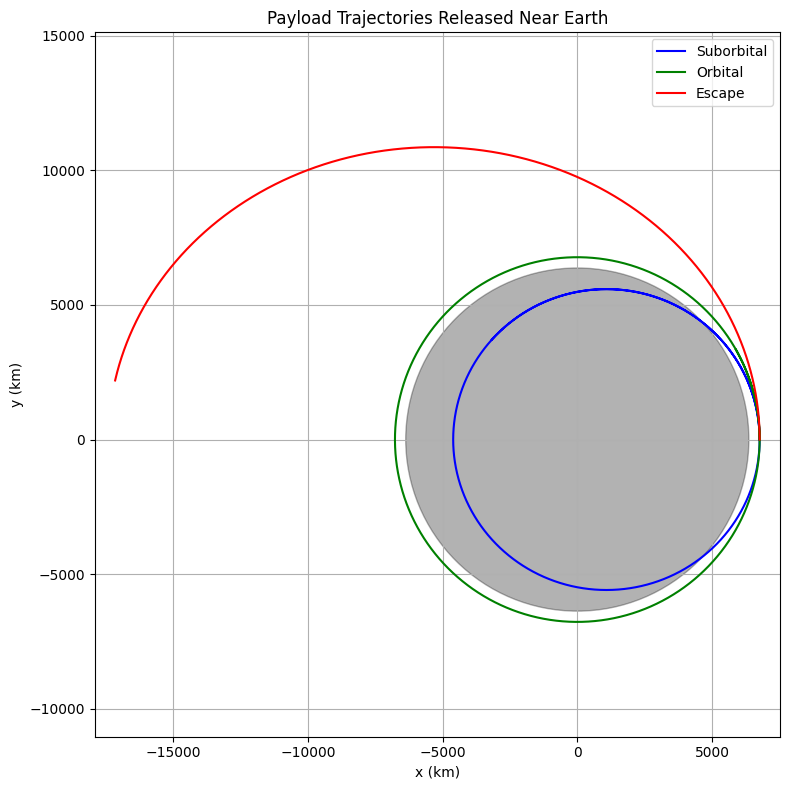

# Problem 3

# Trajectories of a Freely Released Payload Near Earth

## Motivation

When a payload is released from a moving rocket near Earth, its future motion depends on initial speed, direction, and gravitational pull. Such situations are essential to understand for **satellite deployment**, **orbital transfers**, and **safe reentry or escape** missions. This problem blends **gravitational physics**, **orbital mechanics**, and **numerical methods** to simulate and predict these possible trajectories.

---

## Objective

- Analyze different types of trajectories: **elliptical**, **parabolic**, and **hyperbolic**.
- Simulate motion based on **initial conditions** like altitude, speed, and direction.
- Identify whether the object will **orbit**, **fall back**, or **escape**.
- Visualize and interpret results using Python simulations.

---

## Theoretical Foundation

The object follows Newton’s Law of Gravitation:

$$\vec{F} = -\frac{GMm}{r^2} \hat{r}$$

Resulting in the acceleration:

$$\vec{a} = -\frac{GM}{r^2} \hat{r}$$

Where:

- $G = 6.67430 \times 10^{-11} \, \text{Nm}^2/\text{kg}^2$
- $M =$ mass of Earth
- $r =$ distance from Earth’s center

The total energy $ E $ of the system determines the type of trajectory:

- $E < 0$ → **Elliptical Orbit**
- $E = 0$ → **Parabolic Escape**
- $E > 0$ → **Hyperbolic Escape**

---

## Python Simulation

```python
import numpy as np
import matplotlib.pyplot as plt
from scipy.integrate import solve_ivp

# Constants
G = 6.67430e-11  # m^3/kg/s^2
M = 5.972e24     # kg (mass of Earth)
R_earth = 6.371e6  # m

# Define gravitational acceleration
def gravity(t, y):
    x, vx, y_, vy = y
    r = np.sqrt(x**2 + y_**2)
    ax = -G * M * x / r**3
    ay = -G * M * y_ / r**3
    return [vx, ax, vy, ay]

# Initial conditions
altitude = 400e3  # 400 km above surface
r0 = R_earth + altitude
v_circular = np.sqrt(G * M / r0)

# Try different velocities (suborbital, orbital, escape)
initial_velocities = [0.9*v_circular, 1.0*v_circular, 1.2*v_circular]
colors = ['blue', 'green', 'red']
labels = ['Suborbital', 'Orbital', 'Escape']

# Time span
t_span = (0, 6000)  # seconds
t_eval = np.linspace(*t_span, 5000)

plt.figure(figsize=(8, 8))

for v0, color, label in zip(initial_velocities, colors, labels):
    y0 = [r0, 0, 0, v0]  # x, vx, y, vy
    sol = solve_ivp(gravity, t_span, y0, t_eval=t_eval, rtol=1e-8)
    x, y = sol.y[0], sol.y[2]
    plt.plot(x/1000, y/1000, color=color, label=label)

# Earth
circle = plt.Circle((0, 0), R_earth/1000, color='black', alpha=0.3)
plt.gca().add_patch(circle)

plt.xlabel("x (km)")
plt.ylabel("y (km)")
plt.title("Payload Trajectories Released Near Earth")
plt.legend()
plt.axis("equal")
plt.grid(True)
plt.tight_layout()
plt.show()
```


