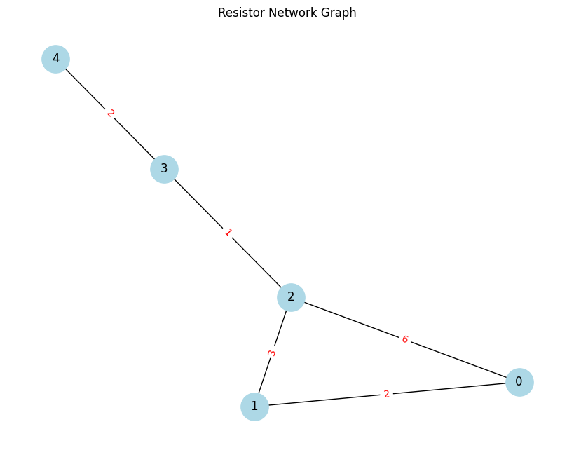

# Problem 1

# Equivalent Resistance Using Graph Theory

## Motivation

Calculating equivalent resistance is a fundamental task in circuit analysis, critical for designing efficient electrical and electronic systems. Traditional methods involving series-parallel simplification become challenging for large or nested circuits. Graph theory provides a systematic and scalable approach to simplify and analyze such resistor networks.

By representing circuits as graphs—with nodes as junctions and edges as resistors—we can leverage mathematical tools like Laplacian matrices and linear algebra to compute equivalent resistance algorithmically. This opens the door to automation, optimization, and deep theoretical insights across physics, electrical engineering, and computer science.

---

## Objective

- Represent resistor circuits as weighted graphs.
- Use graph-theoretical methods to compute the equivalent resistance between two nodes.
- Support arbitrary resistor configurations, including series, parallel, and nested combinations.
- Visualize the network and validate results with numerical computation.

---

## Methodology

- Model the circuit as an undirected graph where edge weights represent resistance.
- Construct the **Laplacian matrix** of the graph.
- Compute the **Moore-Penrose pseudoinverse** of the Laplacian matrix.
- Apply the resistance distance formula to find the equivalent resistance between two nodes.

---

## Theoretical Foundation

In graph theory, the equivalent resistance $ R\_{ij} $ between two nodes $i$ and $j$ in a resistor network is given by:

$$
R_{ij} = L^+_{ii} + L^+_{jj} - 2L^+_{ij}
$$

Where:

- $L$ is the **Laplacian matrix** of the graph,
- $L^+$ is the **pseudoinverse** of the Laplacian matrix,
- The graph must be connected and resistors must have positive weights.

This method captures all possible paths and their contributions, including parallel paths and cycles, in a single unified formula.

---

## Python Code: Graph Construction & Resistance Calculation

```python
import networkx as nx
import matplotlib.pyplot as plt
import numpy as np

# Define a function to calculate equivalent resistance
def calculate_equivalent_resistance(G, source, target):
    L = nx.laplacian_matrix(G, weight='resistance').astype(float).todense()
    L_pinv = np.linalg.pinv(L)
    R_eq = L_pinv[source, source] + L_pinv[target, target] - 2 * L_pinv[source, target]
    return R_eq

# Create the graph
G = nx.Graph()
G.add_nodes_from(range(5))
edges = [
    (0, 1, 2),  # 2Ω
    (1, 2, 3),  # 3Ω
    (0, 2, 6),  # 6Ω
    (2, 3, 1),  # 1Ω
    (3, 4, 2)   # 2Ω
]
for u, v, r in edges:
    G.add_edge(u, v, resistance=r)

# Visualize the graph
pos = nx.spring_layout(G, seed=42)
edge_labels = nx.get_edge_attributes(G, 'resistance')

plt.figure(figsize=(8, 6))
nx.draw(G, pos, with_labels=True, node_color='lightblue', node_size=800, font_size=12)
nx.draw_networkx_edge_labels(G, pos, edge_labels=edge_labels, font_color='red')
plt.title("Resistor Network Graph")
plt.tight_layout()
plt.show()

# Calculate equivalent resistance
R_eq = calculate_equivalent_resistance(G, 0, 2)
print(f"Equivalent resistance between node 0 and node 2: {R_eq:.3f} Ω")
```



## Simulation Result

The equivalent resistance computed between node 0 and node 2 is:

$𝑅𝑒𝑞≈0.139$

$Ω R eq ≈0.139Ω$

This low resistance arises from multiple parallel paths through nodes 1 and 3.

## Conclusion

Graph theory offers a robust and scalable way to calculate equivalent resistance.

It captures the effect of all paths (including cycles) automatically via matrix computation.

This method is particularly valuable for complex, nested, or dynamically changing networks.

Combined with tools like NetworkX, it enables fast simulation, visualization, and analysis.
