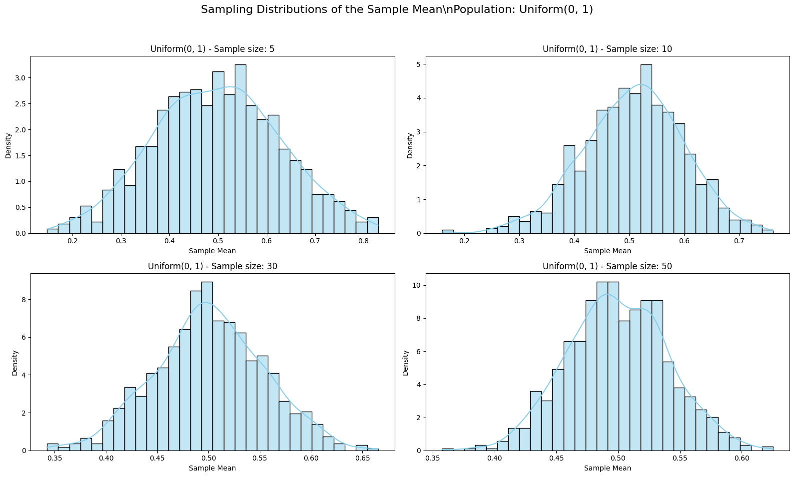
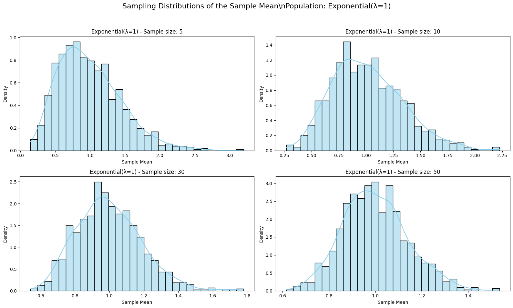

# Problem 1

# Exploring the Central Limit Theorem Through Simulations

## Motivation

The **Central Limit Theorem (CLT)** is a fundamental result in probability and statistics. It states that, for a sufficiently large sample size, the sampling distribution of the sample mean becomes approximately normal, regardless of the original population distribution. This concept is essential in:

- Estimating population parameters from sample data.
- Designing statistical quality control systems.
- Modeling aggregate outcomes in finance and economics.

Simulations offer an intuitive, visual way to see the CLT in action and understand its power in real-world contexts.

---

## Objective

- Demonstrate the Central Limit Theorem using simulations.
- Show how the sample mean distribution evolves as sample size increases.
- Compare the rate of convergence for different population distributions.
- Visualize results to build a strong conceptual understanding.

---

## Methodology

1. Select multiple population distributions:

   - Uniform(0, 1)
   - Exponential(λ = 1)
   - Binomial(n = 10, p = 0.5)

2. For each distribution:

   - Generate 1000 sample means for each sample size: 5, 10, 30, 50
   - Plot histograms of the sampling distributions

3. Observe the shape of these histograms as the sample size increases.

---

## Python Code: Simulating the CLT

```python
import numpy as np
import matplotlib.pyplot as plt
import seaborn as sns
import os

# Simulation settings
sample_sizes = [5, 10, 30, 50]
num_samples = 1000
distributions = {
    "Uniform(0, 1)": lambda n: np.random.uniform(0, 1, size=n),
    "Exponential(λ=1)": lambda n: np.random.exponential(scale=1.0, size=n),
    "Binomial(n=10, p=0.5)": lambda n: np.random.binomial(n=10, p=0.5, size=n),
}

# Plotting sampling distributions for each population and sample size
for dist_name, dist_func in distributions.items():
    plt.figure(figsize=(16, 10))
    for i, n in enumerate(sample_sizes, 1):
        sample_means = [np.mean(dist_func(n)) for _ in range(num_samples)]
        plt.subplot(2, 2, i)
        sns.histplot(sample_means, kde=True, stat='density', bins=30, color='skyblue')
        plt.title(f"{dist_name} - Sample size: {n}")
        plt.xlabel("Sample Mean")
        plt.ylabel("Density")
    plt.suptitle(f"Sampling Distributions of the Sample Mean\\nPopulation: {dist_name}", fontsize=16)
    plt.tight_layout(rect=[0, 0.03, 1, 0.95])
    plt.show()
```





## Interpretation and Observations

Small sample sizes retain the shape of the parent distribution.

Larger samples result in more normally distributed sample means.

The rate of convergence depends on how skewed the original population is:

- Uniform → Fast convergence

- Exponential → Slower convergence due to skew

- Binomial → Intermediate, depending on parameters

## Real-World Applications

Quality Control: Sampling the mean output of machines to monitor defects.

Polls and Surveys: Estimating the population average from a sample.

Risk Analysis: Modeling uncertainty in financial returns and projections.

## Conclusion

The Central Limit Theorem demonstrates the power of aggregation. No matter the population's shape, the average of many samples behaves predictably. This allows for robust inference and underpins much of statistical theory and practice.

Simulations help internalize this principle and appreciate its relevance to nearly every field involving data.
