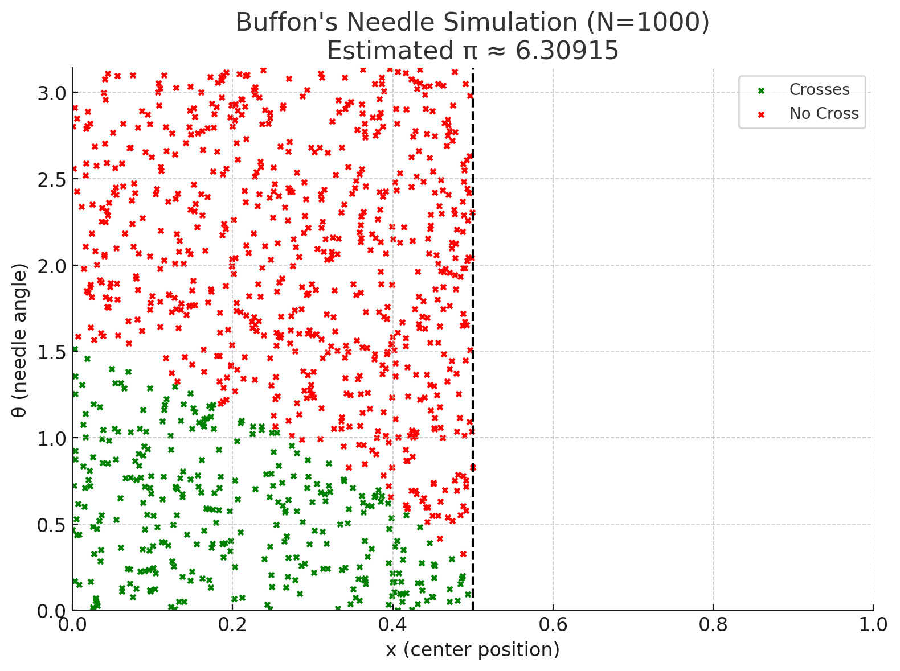

# Problem 2

# Estimating π Using Monte Carlo Methods

## Motivation

Monte Carlo methods use randomness to solve mathematical problems that might be deterministic in principle. One elegant use of Monte Carlo simulation is to estimate the value of π using simple geometric probability or classic experiments like **Buffon’s Needle**. These methods offer an intuitive connection between probability, geometry, and computation — and have real applications in physics, finance, and algorithm design.

---

## Objective

- Estimate π using two Monte Carlo approaches:
  - Random point generation in a circle
  - Buffon’s Needle experiment
- Explore how convergence improves with sample size
- Visualize the estimation process
- Compare their accuracy and efficiency

---

## Theoretical Foundation

### Buffon’s Needle

Buffon’s Needle is one of the oldest problems in **geometric probability**. Suppose we drop a needle of length $L$ onto a plane ruled with parallel lines a distance $d$ apart. The probability $P$ that the needle crosses a line is:

$$P = \frac{2L}{\pi d}$$

Solving for $\pi$, we estimate:

$$\pi \approx \frac{2L \cdot N}{C \cdot d}$$

Where:

- $N$: total number of needle drops
- $C$: number of times the needle crosses a line
- $L$: length of the needle
- $d$: distance between lines

---

## Simulation:

```python
import numpy as np
import matplotlib.pyplot as plt

# Parameters
n_drops = 10000
needle_length = 1.0
line_spacing = 1.0

crosses = 0
x_cross, y_cross = [], []
x_no_cross, y_no_cross = [], []

for _ in range(n_drops):
    x_center = np.random.uniform(0, line_spacing / 2)
    theta = np.random.uniform(0, np.pi)
    x_tip = (needle_length / 2) * np.cos(theta)

    if x_center <= x_tip:
        crosses += 1
        x_cross.append(x_center)
        y_cross.append(theta)
    else:
        x_no_cross.append(x_center)
        y_no_cross.append(theta)

# Estimate π
if crosses > 0:
    pi_estimate = (2 * needle_length * n_drops) / (crosses * line_spacing)
else:
    pi_estimate = None

# Plot the result
plt.figure(figsize=(8, 6))
plt.title(f"Buffon's Needle Simulation (N={n_drops})\\nEstimated π ≈ {pi_estimate:.5f}")
plt.scatter(x_cross, y_cross, s=10, color="green", label="Crosses")
plt.scatter(x_no_cross, y_no_cross, s=10, color="red", label="No Cross")
plt.axvline(line_spacing / 2, color='black', linestyle='--')
plt.xlim(0, line_spacing)
plt.ylim(0, np.pi)
plt.xlabel("x (center position)")
plt.ylabel("θ (needle angle)")
plt.legend()
plt.tight_layout()
plt.show()
```



## Conclusion

Monte Carlo simulations offer a creative, visual, and statistical approach to estimating π using randomness. This project explored two distinct methods:

1. **Circle-based sampling**: Fast and geometrically intuitive. The approximation converges quickly with more points and is easy to visualize.
2. **Buffon’s Needle**: A classical probabilistic method with deeper historical roots. Although less efficient, it beautifully demonstrates how geometry and randomness can work together to reveal fundamental constants.

Through both simulations, we see the strength of Monte Carlo methods in tackling problems that blend theory, computation, and randomness. The convergence trends show that while simple, these methods are powerful tools for understanding the law of large numbers, probability distributions, and numerical estimation.

π, a constant discovered through circles, reappears through needles and points — a poetic reminder of the interconnectedness of math and nature.
