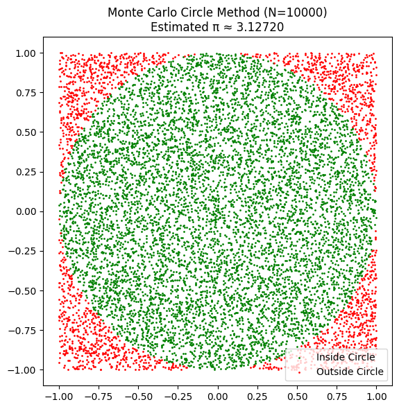
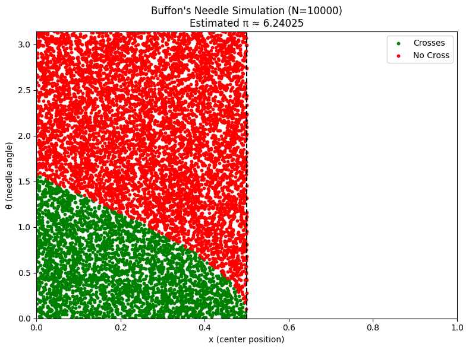

# Problem 2

# Estimating π Using Monte Carlo Methods

## Motivation

Monte Carlo methods use randomness to solve mathematical problems that might be deterministic in principle. One elegant use of Monte Carlo simulation is to estimate the value of π using simple geometric probability or classic experiments like **Buffon’s Needle**. These methods offer an intuitive connection between probability, geometry, and computation — and have real applications in physics, finance, and algorithm design.

This project focuses on two approaches:

- Random sampling inside a square that bounds a quarter-circle
- Buffon's Needle experiment involving geometric probability

Together, they illustrate how randomness and geometry can lead to powerful mathematical insights.

---

## Objective

- Estimate π using two Monte Carlo approaches:
  - Random point generation in a circle
  - Buffon’s Needle experiment
- Explore how convergence improves with sample size
- Visualize the estimation process
- Compare their accuracy and efficiency

---

## Theoretical Foundation

### Circle-Based Monte Carlo Method

This method estimates π by simulating random points inside a square that encloses a unit circle (radius = 1). The idea is based on comparing the area of the circle to the area of the square.

- Area of the unit circle:

  $$
  A_{\text{circle}} = \pi r^2 = \pi
  $$

- Area of the bounding square (side length = 2):

  $$
  A_{\text{square}} = (2r)^2 = 4
  $$

- Ratio of areas:

  $$
  \frac{A_{\text{circle}}}{A_{\text{square}}} = \frac{\pi}{4}
  $$

Therefore, if we randomly generate $N$ points in the square and $M$ fall inside the circle, then:

$$
\pi \approx 4 \cdot \frac{M}{N}
$$

This method is simple and converges as the number of points increases due to the Law of Large Numbers.

---

## Simulation (Circle Method)

```python
import numpy as np
import matplotlib.pyplot as plt

# Parameters
n_points = 10000
inside_x, inside_y = [], []
outside_x, outside_y = [], []

for _ in range(n_points):
    x, y = np.random.uniform(-1, 1), np.random.uniform(-1, 1)
    if x**2 + y**2 <= 1:
        inside_x.append(x)
        inside_y.append(y)
    else:
        outside_x.append(x)
        outside_y.append(y)

pi_estimate = 4 * len(inside_x) / n_points

# Plot
plt.figure(figsize=(6, 6))
plt.title(f"Monte Carlo Circle Method (N={n_points})\nEstimated π ≈ {pi_estimate:.5f}")
plt.scatter(inside_x, inside_y, color='green', s=1, label='Inside Circle')
plt.scatter(outside_x, outside_y, color='red', s=1, label='Outside Circle')
plt.legend()
plt.gca().set_aspect('equal')
plt.tight_layout()
plt.show()

```



---

## Analysis (Circle Method)

- As the number of points increases, the estimate of π becomes more accurate.
- The method has a convergence rate of approximately:

  $$
  O\left(\frac{1}{\sqrt{N}}\right)
  $$

- It is computationally efficient and visually intuitive.

---

## Theoretical Foundation

### Buffon’s Needle

Buffon’s Needle is one of the oldest problems in geometric probability. Suppose we drop a needle of length $L$ onto a plane ruled with parallel lines a distance $d$ apart. The probability $P$ that the needle crosses a line is:

$$
P = \frac{2L}{\pi d}
$$

Solving for $\pi$, we estimate:

$$
\pi \approx \frac{2L \cdot N}{C \cdot d}
$$

Where:

- $N$: total number of needle drops
- $C$: number of times the needle crosses a line
- $L$: length of the needle
- $d$: distance between lines

This method uses a combination of random positions and random angles to approximate crossing probabilities.

---

## Simulation (Buffon’s Needle)

```python
import numpy as np
import matplotlib.pyplot as plt

# Parameters
n_drops = 10000
needle_length = 1.0
line_spacing = 1.0

crosses = 0
x_cross, y_cross = [], []
x_no_cross, y_no_cross = [], []

for _ in range(n_drops):
    x_center = np.random.uniform(0, line_spacing / 2)
    theta = np.random.uniform(0, np.pi)
    x_tip = (needle_length / 2) * np.cos(theta)

    if x_center <= x_tip:
        crosses += 1
        x_cross.append(x_center)
        y_cross.append(theta)
    else:
        x_no_cross.append(x_center)
        y_no_cross.append(theta)

# Estimate π
if crosses > 0:
    pi_estimate = (2 * needle_length * n_drops) / (crosses * line_spacing)
else:
    pi_estimate = None

# Plot the result
plt.figure(figsize=(8, 6))
plt.title(f"Buffon's Needle Simulation (N={n_drops})\nEstimated π ≈ {pi_estimate:.5f}")
plt.scatter(x_cross, y_cross, s=10, color="green", label="Crosses")
plt.scatter(x_no_cross, y_no_cross, s=10, color="red", label="No Cross")
plt.axvline(line_spacing / 2, color='black', linestyle='--')
plt.xlim(0, line_spacing)
plt.ylim(0, np.pi)
plt.xlabel("x (center position)")
plt.ylabel("θ (needle angle)")
plt.legend()
plt.tight_layout()
plt.show()
```

## 

---

## Analysis (Buffon’s Needle)

- The method demonstrates the geometric probability principle in a physical context.
- The convergence is slower and has higher variance compared to the circle method.
- It becomes more accurate with larger $N$, but requires simulating both position and angle.

---

## Conclusion

Monte Carlo simulations offer a creative, visual, and statistical approach to estimating π using randomness. This project explored two distinct methods:

### Circle-based Sampling

- Fast and geometrically intuitive
- Converges quickly
- Simpler to implement

### Buffon’s Needle

- A classical probabilistic method
- Historically significant
- Slower convergence but conceptually rich

Through both simulations, we see the strength of Monte Carlo methods in tackling problems that blend theory, computation, and randomness. The convergence trends show that while simple, these methods are powerful tools for understanding the law of large numbers, probability distributions, and numerical estimation.

π, a constant discovered through circles, reappears through needles and points — a poetic reminder of the interconnectedness of math and nature.
